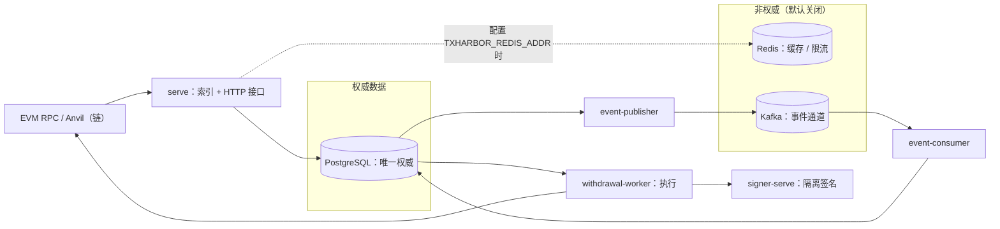

# TxHarbor

面向 EVM / ERC-20 充值与提现的开发演练项目（Go monorepo，单一二进制多子命令）：
把**失败场景下的资金正确性**当作一等公民来设计和验证——幂等、链重组、交易结果未知、
进程崩溃、可靠事件投递。PostgreSQL 是唯一权威数据源；私钥只存在于独立 Signer 进程；
不可逆资金动作不在 HTTP 处理器内执行。**未生产部署，不宣称 production-ready**（见 §7）。

## 1. Overview

TxHarbor 是一个可本地运行、可复现的 **EVM / ERC-20 充值与提现基础设施演练项目**，聚焦资金
基础设施中最难做对的部分：**当链、进程、网络或存储出错时，资金事实仍然正确、可恢复、可审计**。
它覆盖链上索引与确认、链重组恢复、提现接收与执行、nonce 与交易生命周期（含结果未知收敛）、
隔离签名、可靠事件投递，以及跨源对账与备份恢复。

核心原则：

- **PostgreSQL 是唯一权威状态源**：Redis（缓存 / 限流）与 Kafka（事件通道）均非权威，
  其故障不改变资金事实；
- **私钥只存在于独立 Signer 进程**：业务进程只持有签名结果；
- **提现接收与执行分离**：HTTP 请求路径只做认证、授权与幂等持久化，不可逆资金动作由异步
  `withdrawal-worker` 领取执行。

**项目状态**：开发演练项目，**未生产部署、不宣称 production-ready**；生产门禁（KMS/HSM provider、
TLS 终止、生产阈值裁决）尚未关闭，详见 §7。

## 2. Features

- **Deposit Indexing & Reorg Recovery** —— 区块头按高度连续同步并校验 `chain_id`；白名单 ERC-20
  `Transfer` 日志索引；确认深度按 `max(0, tip − block + 1) ≥ N` 判定且阈值版本化。链重组时回溯
  共同祖先、旧分叉失效、受影响充值转 `orphaned` 并重索引重算，修订以
  `deposit.observation.reinstated` / `deposit.revision.applied` 事件表达；恢复可崩溃续跑、重复执行幂等。
- **Withdrawal Execution** —— 提现创建（Bearer 认证 + 逐笔授权 + `UNIQUE(caller_id, idempotency_key)`
  幂等）与执行分离：`withdrawal-worker` 领取 / 续租后完成构造、广播、同字节重播、费用替换、回执与
  预期 `Transfer` 验证；`completed` 后仍保持追踪（重组 / 修订投影为 `revised`）。
- **Nonce & Transaction Lifecycle** —— 并发安全的 nonce 预留与持久绑定、结果未知 / 缺口对账
  （结果未知期间保持 `reconciling`，链上事实明确后收敛为 `completed`；不按失败重发新交易）；
  只读绑定查询端点默认 fail-closed（未配置 token 时拒绝一切读取）。
- **Isolated Signing** —— 私钥只在独立 `signer-serve` 进程与监听器；签名策略上限（链 / 发送方 /
  资产 / 收款方 / 金额与 gas 费用）缺失即拒绝启动；`production` 模式无 KMS/HSM provider 即拒绝启动。
- **Reliable Event Delivery** —— 事务性 Outbox 与业务状态同事务写入；发布器 `SKIP LOCKED` + 租约 +
  `acks=all` 至少一次投递；消费者 inbox 去重、版本守卫、持久进度、有界重试、持久隔离与人工重放。
  **不宣称跨系统恰好一次**。
- **Reconciliation & Disaster Recovery** —— 三路对账（链事实 / PG 业务状态 / 事件投递与消费结果）
  带检查点续跑；备份 → 隔离恢复验证 → 实例核验 → 按能力分级放行（非执行者批准、缺口阻塞、
  旧实例隔离证据），放行前新提现创建返回 `503`；五态故障矩阵与 S1–S12 + F1–F7 灾备演练逐场景判定。

机制细节与生命周期图见 [docs/architecture.md](docs/architecture.md)；各能力的测试入口与证据索引
统一见 [docs/verification-matrix.md](docs/verification-matrix.md)。

## 3. Architecture



三条主要数据流：

- **充值索引**：`链 → serve（连续高度同步 / 日志索引 / 确认判定）→ PostgreSQL`；重组恢复在同一
  租约循环内完成。
- **提现执行**：`serve（接收与准入）→ PostgreSQL → withdrawal-worker → signer-serve（签名）→ 链`；
  请求路径不执行不可逆动作。
- **事件投递**：`PostgreSQL（Outbox）→ event-publisher → Kafka → event-consumer → PostgreSQL`；
  Redis 只承载缓存与限流（默认关闭），**不在事件投递链上**。

**权威性**：PostgreSQL 是唯一权威状态源；Redis / Kafka 非权威（故障不改变资金事实）。

**Signer 信任边界**：私钥只在 `signer-serve`（独立进程与独立监听器，默认 `127.0.0.1:8091`）。
**注意**：独立进程与监听器**不构成网络隔离**，也不存在数据库权限隔离——业务进程
（serve / signer-serve / withdrawal-worker）共用同一 `TXHARBOR_PG_DSN`（见 §7）。

| 进程 | 子命令 | 职责 |
| --- | --- | --- |
| 业务进程 | `serve` | 五条索引流（header / log / deposit / confirmation / recovery）在同一租约循环与心跳下运行；提现接收与 nonce 只读接口、执行准入、健康与指标 |
| 签名进程 | `signer-serve` | 独立监听器（默认 `127.0.0.1:8091`）；`development` 加载本地密钥文件，`production` 无 provider 即拒绝启动 |
| 执行进程 | `withdrawal-worker` | 领取 / 续租、交易生命周期与 Signer 调用、状态投影与恢复追踪 |
| 事件进程 | `event-publisher` / `event-consumer` | 事务性 Outbox 至少一次发布；幂等消费（inbox 去重 / 版本守卫 / 隔离与重放） |

管理 CLI（`migrate` / `apikey-auth` / `withdrawal-authz` / `signer-auth` / `nonce-admin` /
`events-admin` / `reconcile-admin` / `recovery-admin` 等）承载迁移与受控运维（授权供给 / 撤销、
重放、恢复核验与放行）。

- **限流失败策略（PD-1）**：限流拒绝 → `429`（可重试，带 `Retry-After`）；限流不可用（Redis 故障）
  → **仅**新提现创建 `503` 可重试拒绝，其余路径按各自原门禁继续。
- **启动门禁 fail-closed**：必填配置缺失、迁移版本未知 / 未应用、`chain_id` 不匹配、冻结身份
  不一致 → 拒绝启动；**从不自动迁移**。

状态机、恢复机制与配置细节见 [docs/architecture.md](docs/architecture.md)。

## 4. Getting Started

依赖：Go 1.26.5（`go.mod`）、Docker + Docker Compose；bash / zsh（Linux、macOS 或 WSL2）。

```bash
cp .env.example .env          # 模板覆盖基础 / 充值链必填键，并登记事件基础设施键（默认注释）
set -a; source .env; set +a   # 按需修改后加载

docker compose up -d                 # PostgreSQL(127.0.0.1:5432) + Anvil(127.0.0.1:8545)
go run ./cmd/txharbor migrate up     # 应用迁移（000001–000018）；serve 不会自动迁移
go run ./cmd/txharbor migrate status # 查看迁移状态（current_version / pending）
go run ./cmd/txharbor serve          # 业务进程（默认 127.0.0.1:8080）

curl -fsS http://127.0.0.1:8080/livez    # {"status":"alive"}
curl -fsS http://127.0.0.1:8080/readyz   # chain / db / rpc / version 检查
curl -fsS http://127.0.0.1:8080/metrics  # Prometheus 指标（txharbor_* 系列）
```

**必填配置（照抄模板不足以启动）**：

- `serve`：`.env.example` 中 `Required` 的 10 个键 **加上 `TXHARBOR_REORG_MAX_DEPTH`**（重组最大
  深度，无默认值，缺失即拒绝启动）；
- `signer-serve`：9 个签名策略键（链 / 发送方 / 资产 / 收款方 / 金额与 gas 费用上限）；`MODE` 默认
  `production`（无 KMS/HSM provider 即拒绝启动），`development` 模式另需 `KEY_FILE`；
- `withdrawal-worker`：`TXHARBOR_TX_SIGNER_URL` / `TXHARBOR_TX_SIGNER_CREDENTIAL`（+ 继承的
  DSN / RPC）。

逐键说明、默认值与恢复 CLI 键集见 [docs/configuration.md](docs/configuration.md)。
注意：模板缺少 `TXHARBOR_REORG_MAX_DEPTH` 及部分后续阶段键（事件基础设施键已以注释形式登记、
默认不生效），补全方案见 §7 Roadmap。

可选叠加：

- Signer 隔离叠加：`compose.009.yaml`（project `txharbor-009`、`127.0.0.1:5433`）；
- 事件通道：`docker compose --profile events up -d` + `TXHARBOR_EVENTS_ENABLED=true`
  （启用时必填键见配置参考）；
- 恢复 CLI：`recovery-admin`（需独立控制库与主体配置，见配置参考 §7）。

**验证状态**：健康端点与 `migrate status` 的响应形状已按实现核对；`compose up → migrate up →
serve` 的**完整冷启动尚未执行验证** → **NOT VERIFIED**。

## 5. Example Workflows

**交互式一键 Demo 尚未实现**：仓库不提供 `make demo` 之类的一键脚本；以下为可执行的自动化验证
入口，分别覆盖充值、提现与故障恢复三条主线（完整测试矩阵见 §6）。

| 工作流 | 入口 | 覆盖内容 |
| --- | --- | --- |
| 充值：索引与重组恢复 | `make test-integration` | 连续高度同步、白名单日志索引、确认深度切换、链重组恢复（真实 PostgreSQL 层） |
| 提现：接收与执行 | `make test-e2e` | 接收幂等、逐笔授权、nonce 预留与绑定、隔离签名、真实广播与应答丢失恢复（恢复后不重复发送）、回执与预期 `Transfer` 验证 |
| 故障恢复与演练 | `make test-fault`；`TXHARBOR_DRILL_EVIDENCE_DIR=<dir> make test-drill` | 五态故障矩阵；S1–S12 + F1–F7 灾备演练（逐场景 PASS 判定，缺失 / 跳过即失败） |

同字节重播与费用替换的具名载体在 integration 层：`internal/txlifecycle/replay_integration_test.go`、
`internal/txlifecycle/replacement_integration_test.go`。

**手工分步演示**（启动栈 → 签发调用方凭据 → 供给授权 → `POST /withdrawals` → 运行 worker →
观察链上结果）：尚无专用脚本，步骤形状见 `specs/007-withdrawal-creation/quickstart.md`、
`specs/008-nonce-manager/quickstart.md`、`specs/011-withdrawal-executor/quickstart.md`。
**NOT VERIFIED**：手工路径未执行；自动化方案列为 Roadmap（§7）。

## 6. Testing & Verification

| 入口 | 用途 | Docker |
| --- | --- | --- |
| `make test` / `make test-race` | 单元测试 / race 检测 | 否 |
| `make test-contract` | 事件信封、目录、schema 版本、消费者兼容与 014/015 契约 | 否 |
| `make test-integration` | PostgreSQL 层集成（testcontainers） | 是 |
| `make test-integration-redis` / `make test-integration-kafka` | Redis / Kafka 层集成 | 是 |
| `make test-e2e` | 核心充提全链（全栈 + Anvil） | 是 |
| `make test-fault` / `make test-perf` | 五态故障矩阵 / 性能对照测量（独立层，不进普通 PR） | 是 |
| `make test-drill` | 灾备演练 S1–S12 + F1–F7（独立通道；需真实 PG / Anvil、事件场景需 Kafka、宿主 `pg_dump` / `pg_restore`） | 是 |
| `make lint` / `make build` | gofmt + vet（双标签）/ 构建 | 否 |

> ⚠️ **`make db-reset` 会删除数据**（等价 `docker compose down -v`，移除 PostgreSQL 数据卷且不可
> 恢复）——与测试命令分开使用，勿在需要保留数据的栈上执行。

- **状态口径**：**PASS**（该树 / 该运行有留存证据）· **FAIL**（有失败证据，含原因未确认者）·
  **NOT RUN**（该次未执行，不得读作通过）· **NOT VERIFIED**（无留存证据或未复跑）。逐层证据、
  历史运行与失败披露见 **[docs/verification-matrix.md](docs/verification-matrix.md)**。
- **分层守卫**：Redis / Kafka / Contract / E2E / Fault / Perf / Drill 入口带 `require_tagged_tests`
  守卫（无对应 tag 测试报 NOT RUN 并非零退出）；drill 另由 JSON 检查器逐场景要求 PASS。
- **历史证据 ≠ 当前 HEAD**：已留存 CI 运行均针对各自历史 head；当前 HEAD 各层未复跑 → NOT VERIFIED。
- **验证纪律**：原始归档（清单 / 指纹）+ 独立复算；性能只做测量与定位（`perf` 构建标签接缝，
  普通构建 no-op），不宣称性能提升。

CI：[Actions](https://github.com/xtianxx/TxHarbor/actions)（普通 PR 分层门禁 + 独立通道
fault-perf / drill）。

## 7. Limitations & Roadmap

**限制**：

- **未生产部署**：不宣称 production-ready；生产门禁（KMS/HSM provider、TLS 终止、生产阈值裁决）
  尚未关闭（见 `docs/project-context.md`）。
- **不维护用户余额账本**：资金事实来自链上观察与请求 / 执行状态。
- **不宣称跨系统 Exactly-Once**：事件投递语义为「至少一次 + 消费幂等」。
- **无生产 KMS/HSM**：v1 仅本地 `development` 密钥 provider；`production` 模式拒绝启动。
- **无应用内 TLS**：明文监听，需前置终止；**无 Dockerfile**（Go 进程在宿主运行）。
- **数据库权限未隔离**：业务进程共用同一业务 DSN（无角色隔离；恢复 CLI 另用独立控制库）。
- **生产阈值与 SLO 未确定**：容量 / 限流 / 告警 / 追赶窗口与备份恢复 RPO/RTO 等均为本地测试
  输入，待裁决。

**Roadmap（主要工程方向，未实施）**：

1. 生产化门禁：KMS/HSM provider、TLS 终止方案与生产阈值裁决；
2. `.env.example` 模板补全（`TXHARBOR_REORG_MAX_DEPTH` 及部分后续阶段键）与 Quick Start 冒烟脚本
   （一条命令验证 compose → migrate → serve → 健康端点 / 指标）；
3. 一键 E2E Demo（手工充提路径自动化，复用现有测试夹具，见 §5）；
4. 独立通道（Fault / Perf / Drill）的常规运行与归档维护。

## 8. Documentation

| 读者任务 | 文档 |
| --- | --- |
| Architecture & Design | [docs/architecture.md](docs/architecture.md) —— 组件 / 生命周期图、PostgreSQL 权威设计、Signer 边界、Outbox/Inbox 语义、恢复与对账、设计取舍 |
| Configuration & Development | [docs/configuration.md](docs/configuration.md) —— env 配置参考；`.env.example` 与 `compose.yaml` / `compose.009.yaml` 提供本地依赖 |
| Testing & Verification | [docs/verification-matrix.md](docs/verification-matrix.md) —— 验证矩阵与证据索引；`docs/evidence/` —— 证据归档 |
| Security & Recovery | [docs/ops/recovery-runbook.md](docs/ops/recovery-runbook.md) —— 备份 / 恢复 / 核验 / 放行 |
| Specifications | `specs/001-project-foundation/` … `specs/015-backup-recovery-safe-resumption/` —— 编号 → 能力映射：002 链索引，003 日志索引，004 充值检测，005 确认跟踪，006 重组恢复，007 提现创建，008 nonce 管理，009 签名服务，010 交易生命周期，011 执行，012 授权载体，013 事件基础设施，014 对账处置，015 备份恢复 |
| Changelog & License | [CHANGELOG.md](CHANGELOG.md) —— 变更记录；[THIRD_PARTY.md](THIRD_PARTY.md) —— 依赖与许可说明（仓库暂无独立 LICENSE 文件） |

> README 正文以能力名叙述、避免内部阶段编号；需要精确定位时使用上表的编号映射。

## 9. Technology Stack

| 组件 | 版本（以 `go.mod` / `compose.yaml` 为准） | 用途 |
| --- | --- | --- |
| Go | 1.26.5 | 单一二进制、多子命令 |
| PostgreSQL | `postgres:18.6-trixie` | 唯一权威数据源（goose 迁移 embed 进二进制） |
| go-ethereum | v1.17.5 | EVM 类型、RPC 与签名工具 |
| franz-go（+ kadm） | v1.22.0 / v1.19.0 | Kafka 客户端（显式建 topic，auto-create 关闭） |
| go-redis | v9.22.0 | 非权威缓存 / 限流载体 |
| Prometheus client_golang | v1.24.1 | `/metrics` 指标 |
| Testcontainers-go | v0.44.0 | 集成测试中间件（postgres / redis / kafka 模块） |
| Anvil（foundry） | `v1.8.1` | 本地链（`127.0.0.1:8545`，chain-id 31337） |
| Redis / Kafka 镜像 | `redis:8.2.10-alpine` / `apache/kafka:4.1.0` | 仅 `events` profile；非权威 |

### Repository Structure

```
cmd/txharbor/            单一二进制入口（子命令 dispatch）
internal/                业务实现（充值索引 / 提现与执行 / nonce / 签名 / 事件 / 对账 / 恢复等域）
migrations/              goose 迁移 000001–000018（embed 进二进制）
specs/                   001–015 规格（spec / plan / tasks / data-model / contracts / ADR）
docs/                    architecture / configuration / verification-matrix / ops / evidence
scripts/                 测量与演练工具（consumerseg / perfseg / drillcoverage / pgintegration）
.github/workflows/       ci.yml（普通 PR + main 分层门禁）、fault-perf.yml、drill.yml（独立通道）
```
