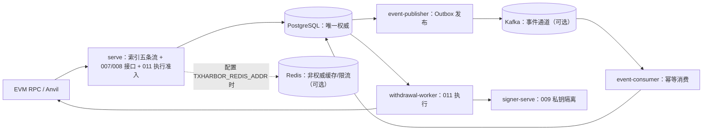

# TxHarbor

面向 EVM / ERC-20 充值与提现流程的开发演练项目（Go monorepo，单一二进制多子命令）：
把**失败场景下的资金正确性**当作一等公民来设计和验证——幂等、链重组、交易结果未知、
进程崩溃、可靠事件投递。PostgreSQL 是唯一权威数据源；私钥只存在于独立 Signer 进程；
不可逆资金动作不在 HTTP 处理器内执行。**未生产上线**（见 §9）。

> 简历/展示材料（30 秒介绍、5 分钟演示讲稿、面试问答）：[docs/portfolio.md](docs/portfolio.md)

## 1. Overview

TxHarbor 用一套可本地运行、可复现的证据链，展示资金基础设施中「正确性优先」的工程做法：

- 覆盖 EVM / ERC-20 **充值**与**提现**全流程：链上索引与确认、重组恢复、受认证接收、逐笔授权、
  nonce 绑定、隔离签名、交易生命周期与执行 worker、结果未知对账、备份恢复与安全续跑。
- 每个失败场景都有对应的一等公民机制与测试入口：数据库约束幂等、显式状态机、
  租约/心跳、崩溃边界测试、事务性 Outbox、故障矩阵与灾备演练。
- **性质**：开发演练项目（非生产系统）。未部署、T000-P 保持 OPEN、不提供生产 SLO；
  性能内容一律只做「测量与定位」。

## 2. Engineering Highlights

- **Deposit（充值索引与确认）**：区块头按高度连续同步并校验 `chain_id`；白名单 ERC-20 `Transfer`
  日志索引，启动时比对冻结配置身份（起始高度 + 白名单哈希）；确认深度按
  `max(0, canonical_tip − block_number + 1) ≥ N` 判定，阈值版本化、切换触发重判。
- **Reorg（链重组恢复）**：分叉检测 → 配置深度内共同祖先 → 旧分叉失效 → 受影响充值转 `orphaned`
  → 重索引与重算确认；恢复状态持久化、可崩溃续跑、重复执行幂等；修订以
  `deposit.observation.reinstated` / `deposit.revision.applied` 事件表达并由消费者幂等吸收。
- **Withdrawal（提现接收与执行）**：Bearer 认证 + 固定权限 + 逐笔授权；幂等由
  `UNIQUE(caller_id, idempotency_key)` 保证；**接收 ≠ 执行**——执行由 worker 领取/续租，
  经构造、广播、同字节重播、费用替换、回执与预期 `Transfer` 验证，`completed` 后仍保持追踪。
- **Nonce（预留与持久绑定）**：并发安全的预留与持久绑定、结果未知/缺口对账；
  只读绑定查询端点（未配置 token 时拒绝一切读取）。
- **Signer（隔离签名）**：独立进程与监听器，私钥不进入业务进程；签名策略上限（链/发送方/资产/
  收款方/金额与 gas 费用上限）缺失即拒绝启动；`production` 模式无 KMS/HSM provider 即拒绝启动。
- **Events（可靠事件投递）**：事务性 Outbox 与业务状态同事务写入；发布器以 `SKIP LOCKED` +
  租约 + `acks=all` 至少一次投递；消费者 inbox 去重、版本守卫、持久进度、有界重试、
  持久隔离与人工重放；**不宣称跨系统恰好一次**。
- **Recovery（故障恢复与对账）**：014 三路对账（链事实 / PG 业务状态 / 事件投递与消费结果）
  处置跨源差异（未知结果由 010/011 按链上事实收敛，014 提供扫描与处置兜底）；015 备份 → 隔离恢复验证 →
  实例核验 → **按能力分级放行**（按能力/副作用范围要求单人或双人非执行者批准；缺口阻塞、旧实例隔离证据）；
  五态故障矩阵与灾备演练（S1–S12 + F1–F7）逐场景判定。
- **Verification（证据工程）**：原始归档（清单/指纹）+ 独立复算 + review 闭合；
  性能用 `perf` 构建标签接缝（普通构建 no-op）做 ON/OFF 配对测量，只报告定位结论。

## 3. Architecture



| 进程 | 子命令 | 职责 |
| --- | --- | --- |
| 业务进程 | `serve` | 单 HTTP 监听器；索引五条流在同一租约循环与心跳下运行；挂载 007/008 接口、011 执行准入与健康/指标 |
| 签名进程 | `signer-serve` | 独立监听器（默认 `127.0.0.1:8091`）；`development` 加载本地密钥文件，`production` 无 provider 即拒绝启动 |
| 执行进程 | `withdrawal-worker` | 领取/续租、调用交易生命周期与 Signer、状态投影与恢复追踪 |
| 事件进程 | `event-publisher` / `event-consumer` | 事务性 Outbox 发布（至少一次）与幂等消费（inbox/版本守卫/隔离与重放） |
| 管理 CLI | `migrate` / `confirm-auth` / `apikey-auth` / `withdrawal-authz` / `nonce-admin` / `signer-auth` / `withdrawal-exec` / `events-admin` / `reconcile-admin` / `recovery-admin` | 迁移与受控运维（授权供给/撤销、重放、恢复核验与放行等） |

要点：PostgreSQL 唯一权威；Outbox 经发布器投递到 Kafka 再消费，**Redis 不在该链上**；
限流失败策略为 PD-1（限流拒绝 `429`；限流不可用仅新提现创建 `503`，查询回退 PG，其余按原门禁继续）；
启动门禁 fail-closed（数据库版本不兼容拒绝启动且从不自动迁移）。
细节与生命周期图见 **[docs/architecture.md](docs/architecture.md)**。

## 4. Design Decisions

| 决策 | 选择 | 取舍 / 理由 |
| --- | --- | --- |
| 事实来源 | PostgreSQL 单一权威；Redis/Kafka 非权威 | 缓存/队列故障不改变资金事实，恢复只需回到 PG |
| 幂等 | 数据库 UNIQUE 约束（非应用层检查） | 并发下不依赖进程内状态；重复请求可安全重放 |
| 投递语义 | 至少一次 + 消费幂等 | 跨系统恰好一次代价与故障面更大；不宣称恰好一次 |
| 状态设计 | 全显式状态机 + 版本守卫 | 可审计、可对账；代价是迁移与守卫代码量 |
| 资金动作位置 | 不可逆动作移出 HTTP 处理器 | 请求路径只做接收/准入；执行由 worker 承担 |
| 启动门禁 | fail-closed（配置/迁移版本/`chain_id`/冻结身份） | 宁可拒绝启动，不进入未定义状态 |
| 缓存/限流 | 默认关闭、按需启用；PD-1 失败策略 | 默认 PG-only 基线可运行；仅新提现创建 fail-closed |
| 密钥管理 | v1 仅 development 密钥 provider | 无 KMS/HSM；`production` 模式拒绝启动 |
| 恢复放行 | 按能力分级 + 非执行者批准（single/dual 按能力与副作用）+ 缺口阻塞 | 不用「数据库可连接」代替资金门禁 |

决策出处：`specs/013-reliable-event-infrastructure/adr.md`、`specs/015-backup-recovery-safe-resumption/adr/`、
各阶段 spec/plan 与代码注释。

## 5. Quick Start

依赖：Go 1.26.5、Docker + Docker Compose；bash/zsh（Linux、macOS 或 WSL2）。

```bash
cp .env.example .env          # 模板：覆盖 001–005 必填键 + 013 键（默认注释）
set -a; source .env; set +a   # 按需修改后加载

docker compose up -d                 # PostgreSQL(127.0.0.1:5432) + Anvil(127.0.0.1:8545)
go run ./cmd/txharbor migrate up     # 应用迁移（000001–000018）；serve 不会自动迁移
go run ./cmd/txharbor serve          # 业务进程

curl -fsS http://127.0.0.1:8080/livez    # 健康检查（默认 TXHARBOR_HTTP_ADDR=127.0.0.1:8080）
curl -fsS http://127.0.0.1:8080/readyz
curl -fsS http://127.0.0.1:8080/metrics  # Prometheus 指标
```

> ⚠️ `.env.example` **不是完整启动清单**：`serve` 的最小必填集 = 模板中 `Required` 的 10 个键
> **加上 006 的 `TXHARBOR_REORG_MAX_DEPTH`**；`signer-serve` 需 9 个策略键 + `MODE`/`KEY_FILE`；
> `withdrawal-worker` 需 `TXHARBOR_TX_SIGNER_URL`/`TXHARBOR_TX_SIGNER_CREDENTIAL`（+ 继承的 DSN/RPC）。
> 逐键说明、默认值与 013/015 键集见 **[docs/configuration.md](docs/configuration.md)**。

可选：009 隔离叠加（`compose.009.yaml`，project `txharbor-009`、`127.0.0.1:5433`）；
013 事件通道 `docker compose --profile events up -d` + `TXHARBOR_EVENTS_ENABLED=true`
（启用时必填键见配置参考）；015 恢复 CLI `recovery-admin`（需独立控制库与主体配置）。

## 6. End-to-End Demo

复用的现成入口（均为仓库现有命令；**本轮文档整理未执行**，见 §7 状态口径）：

1. **充值链演示**：`make test-integration` —— 真实 PostgreSQL 层上演示连续高度同步、白名单日志索引、
   确认深度切换与重组恢复。
2. **提现链演示**：`make test-e2e` —— 核心充提全链（全栈 + Anvil）：接收幂等、逐笔授权、
   nonce 预留与绑定、隔离签名、真实广播与应答丢失后的恢复（恢复后不重复发送）、回执与预期
   `Transfer` 验证；同字节重播与费用替换的具名载体在 integration 层
   （`internal/txlifecycle/replay_integration_test.go`、`internal/txlifecycle/replacement_integration_test.go`）。
3. **失败场景演示**：`make test-fault`（五态故障矩阵）；`TXHARBOR_DRILL_EVIDENCE_DIR=<dir> make test-drill`
   （S1–S12 + F1–F7，逐场景 PASS 判定，缺失/跳过即失败）。
4. **5 分钟讲稿**：[docs/portfolio.md](docs/portfolio.md) §2（启动入口 → 充值 → 提现 → 故障恢复）。

手工分步演示（启动栈 → 签发调用方凭据 → 供给授权 → `POST /withdrawals` → 运行 worker → 观察链上结果）
目前没有专用自动化脚本，步骤形状见 `specs/007-withdrawal-creation/quickstart.md`、
`specs/008-nonce-manager/quickstart.md`、`specs/011-withdrawal-executor/quickstart.md`。
**NOT VERIFIED**：手工路径本轮未执行；建议的最小增量方案是新增 demo 自动化脚本
（建议放在 `scripts/` 下的新子目录，复用上述测试夹具），作为独立后续任务。

## 7. Testing & Verification

| 入口 | 用途 | Docker |
| --- | --- | --- |
| `make test` / `make test-race` | 单元测试 / race 检测 | 否 |
| `make test-contract` | 事件信封、目录、schema 版本、消费者兼容与 014/015 契约 | 否 |
| `make test-integration` | PostgreSQL 层集成（testcontainers） | 是 |
| `make test-integration-redis` / `make test-integration-kafka` | Redis / Kafka 层集成 | 是 |
| `make test-e2e` | 核心充提全链（全栈 + Anvil） | 是 |
| `make test-fault` / `make test-perf` | 五态故障矩阵 / 对照基准（独立层，不进普通 PR） | 是 |
| `make test-drill` | 灾备演练 S1–S12 + F1–F7（独立通道；需真实 PG/Anvil、事件场景需 Kafka、宿主 `pg_dump`/`pg_restore`） | 是 |
| `make lint` / `make build` / `make db-reset` | gofmt+vet（双标签）/ 构建 / 删除数据卷 | 否 / 否 / 是 |

- 013 起新增的分层入口（Redis/Kafka/Contract/E2E/Fault/Perf/Drill）带 `require_tagged_tests` 守卫：
  无对应 tag 测试时报 **NOT RUN** 并非零退出（PostgreSQL `test-integration` 直接调用 `go test`，无该守卫）；
  drill 由 JSON 检查器逐场景要求 PASS（缺失/跳过即失败）。
- 状态口径（PASS / FAIL / NOT RUN / NOT VERIFIED）、已留存 CI 运行（含失败披露与未确认原因）、
  性能测量条件与局限、声明→证据对照：见 **[docs/verification-matrix.md](docs/verification-matrix.md)**。
- 本次文档整理未执行任何测试层；对当前 main 的验证状态以上述矩阵为准。

## 8. Technology Stack & Repository Structure

| 组件 | 版本（以 `go.mod` / `compose.yaml` 为准） | 用途 |
| --- | --- | --- |
| Go | 1.26.5 | 单一二进制、多子命令 |
| PostgreSQL | `postgres:18.6-trixie` | 唯一权威数据源（goose 迁移，embed 进二进制） |
| pgx / goose | v5.11.0 / v3.28.0 | PG 驱动与连接池 / 迁移 |
| go-ethereum | v1.17.5 | EVM 类型、RPC、签名工具 |
| franz-go（+ kadm） | v1.22.0 / v1.19.0 | Kafka 客户端与显式建 topic（auto-create 关闭） |
| go-redis | v9.22.0 | 非权威缓存与分布式限流载体 |
| prometheus/client_golang | v1.24.1 | `/metrics` 指标 |
| testcontainers-go（+ postgres/redis/kafka 模块） | v0.44.0 | 集成测试中间件 |
| Anvil（foundry） | `v1.8.1` | 本地链（`127.0.0.1:8545`，chain-id 31337） |
| Redis / Kafka | `redis:8.2.10-alpine` / `apache/kafka:4.1.0` | 仅 `events` profile；非权威 |

```
cmd/txharbor/            单一二进制入口（子命令 dispatch）
internal/
  app/ config/ db/ eth/ health/ logx/ metrics/      装配与 HTTP 面、配置、PG/迁移、链客户端、健康与指标、脱敏
  indexer/ withdrawal/ nonce/ signer/ txlifecycle/ execution/ jointwire/   充值链与提现链各域
  events/ cache/ ratelimit/                         事件基础设施与非权威缓存/限流
  reconciliation/ recovery/ faultdrill/ perf/       对账、备份恢复、故障与性能演练
migrations/              goose 迁移 000001–000018（embed）
scripts/                 consumerseg/ perfseg/ drillcoverage/ pgintegration/（测量与演练工具）
specs/                   001–015 规格（spec / plan / tasks / data-model / contracts / ADR）
docs/                    portfolio / architecture / configuration / verification-matrix / ops / evidence
.github/workflows/       ci.yml（普通 PR + main 分层门禁）、fault-perf.yml、drill.yml（独立通道）
```

## 9. Limitations & Roadmap

**限制（保留自实现事实）**：

- **不维护用户余额账本**：资金事实来自链上观察与请求/执行状态。
- **不宣称跨系统恰好一次**：事件投递语义为「至少一次 + 消费幂等」。
- **未生产上线**：013/014/015 已合入 main，但**未部署**；T000-P 保持 OPEN
  （`docs/project-context.md`、`specs/011-withdrawal-executor/integration-readiness.md`）。
- **无 KMS/HSM**：v1 仅本地 `development` 密钥 provider；**无应用内 TLS**（明文监听，需前置终止）；
  **无 Dockerfile**（Go 进程在宿主运行）；Serve/Signer/Worker 共用同一 DSN（无角色隔离）。
- **阈值待裁决**：容量/限流/告警/追赶窗口与 015 的 RPO/RTO/频率/保留均为本地测试输入。
- **性能与 CI 表述纪律**：性能只做测量与定位；main 首次 CI 失败原因未确认，同 SHA 重试通过
  不构成根因修复结论。

**Roadmap（未实施，按依赖排序的建议）**：

1. 关闭 T000-P 前的生产门禁项（上游 provider 附录、生产阈值裁决）；
2. KMS/HSM provider 与 TLS 终止方案（当前为显式延后项）；
3. 手工充提演示的自动化脚本（§6 的最小增量方案）；
4. 远端独立通道（Fault/Perf/Drill）的常规运行与归档维护（已有历史远端通过记录：
   Fault/Perf run `37297533285`、Perf `37643963489`、Drill `37576884648`；合并后当前树的重跑与归档仍需持续维护）。

## 10. Documentation

| 文档 | 内容 |
| --- | --- |
| [docs/architecture.md](docs/architecture.md) | 组件/生命周期图、PostgreSQL 权威设计、Signer 边界、Outbox/Inbox 语义、恢复与对账、设计取舍 |
| [docs/configuration.md](docs/configuration.md) | env 配置参考：各进程必填/可选键、默认值、端口与模板覆盖范围 |
| [docs/verification-matrix.md](docs/verification-matrix.md) | 验证矩阵、CI 运行（含失败披露）、性能条件与局限、声明→证据对照 |
| [docs/portfolio.md](docs/portfolio.md) | 简历展示材料（30 秒介绍、5 分钟讲稿、面试问答） |
| [docs/ops/recovery-runbook.md](docs/ops/recovery-runbook.md) | 恢复操作手册（备份/恢复/核验/放行） |
| [CHANGELOG.md](CHANGELOG.md) / [THIRD_PARTY.md](THIRD_PARTY.md) | 变更记录 / 依赖与许可说明 |
| `specs/001-project-foundation/` … `specs/015-backup-recovery-safe-resumption/` | 各阶段规格（内部编号 → 能力映射：002–006 充值链，007–012 提现链，013 事件，014 对账，015 备份恢复） |
| `docs/evidence/` | 证据归档：013（事件）、013-supplement/consumer-seg（分段测量）、014、015、019-normal-query-seg |
| [Actions](https://github.com/xtianxx/TxHarbor/actions) | CI：普通 PR 分层门禁 + 独立通道（fault-perf / drill） |
