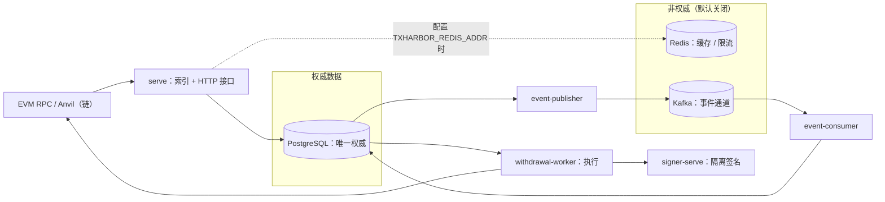

# TxHarbor

**Go / PostgreSQL 实现的 EVM / ERC-20 充值、提现与交易基础设施项目。**

重点解决失败场景下的资金操作正确性：重复请求、链重组、交易结果未知、进程崩溃和事件重复投递。

- **充值与恢复**：连续高度同步、日志索引与确认跟踪；重组后定位共同祖先、失效旧分叉并重索引，可崩溃续跑。
- **提现与交易**：接收与异步执行分离，nonce 预留与持久绑定；结果未知时按链上事实对账，私钥限定于独立 Signer 进程。
- **可靠事件**：业务状态与 Outbox 同事务写入，至少一次投递；消费侧去重、版本守卫、有界重试与隔离重放。

[启动与健康检查](#4-getting-started) · [架构与设计取舍](docs/architecture.md) · [测试入口](#5-testing--verification) · [验证证据](docs/verification-matrix.md) · [v1.0.0 本地工程版本](https://github.com/xtianxx/TxHarbor/releases/tag/v1.0.0)

**项目状态**：开发与验证阶段，未生产部署，不维护用户余额账本。v1.0.0 为历史本地工程版本，当前主线新增能力及各层验证状态以文档和对应运行记录为准。启动示例用于运行服务与检查健康状态；交互式充提 Demo 尚未脚本化（见 §5）。

## 1. Overview

TxHarbor 是一个可本地运行、可复现的 **EVM / ERC-20 充值与提现基础设施项目**，专注于资金基础
设施中最难做对的部分：链上索引与确认、链重组恢复、提现接收与执行、nonce 与交易生命周期、
隔离签名、可靠事件投递、跨源对账与备份恢复；并以自动化测试与归档证据逐项验证。

核心原则与信任边界见 §3；实现细节（状态机、表结构、事件词汇、配置键）见 `docs/`（§7）。

## 2. Features

- **Deposit Indexing & Reorg Recovery** —— 连续高度同步与白名单 ERC-20 日志索引，按版本化确认
  深度判定充值确认；链重组时回溯共同祖先、失效旧分叉并重索引受影响充值，恢复过程可崩溃续跑且
  重复执行幂等。
- **Withdrawal Execution** —— 接收与执行分离：请求路径只做认证、逐笔授权与幂等持久化，不可逆的
  资金动作由异步 worker 领取执行（构造、广播、回执校验）；完成态仍保持追踪，以吸收链上修订。
- **Nonce & Transaction Lifecycle** —— 并发安全的 nonce 预留与持久绑定；交易结果未知时按链上
  事实对账收敛、缺口对账补正，而不是按失败重发。
- **Isolated Signing** —— 私钥只存在于独立 Signer 进程；签名策略上限缺失即拒绝启动，生产模式
  无外部密钥 provider 即拒绝启动。
- **Reliable Event Delivery** —— 事务性 Outbox 与业务状态同事务写入，至少一次投递叠加消费幂等
  （去重、版本守卫、有界重试、隔离与人工重放）。
- **Reconciliation & Disaster Recovery** —— 链事实 / PG 业务状态 / 事件消费结果三路对账，备份
  恢复按能力分级放行；故障矩阵与灾备演练逐场景判定。

机制、状态机与事件词汇见 [docs/architecture.md](docs/architecture.md)；各能力的测试入口与证据
索引见 §5。

## 3. Architecture



- **充值索引**：`链 → serve（连续高度同步 / 日志索引 / 确认判定）→ PostgreSQL`；重组恢复在同一
  租约循环内完成。
- **提现执行**：`serve（接收与准入）→ PostgreSQL → withdrawal-worker → signer-serve（签名）→ 链`；
  请求路径不执行不可逆动作。
- **事件投递**：`PostgreSQL（Outbox）→ event-publisher → Kafka → event-consumer → PostgreSQL`；
  Redis 只承载缓存与限流（默认关闭），**不在事件投递链上**。

**权威性**：PostgreSQL 是唯一权威状态源；Redis / Kafka 非权威（故障不改变资金事实）。

**Signer 信任边界**：私钥只在 `signer-serve`（独立进程与独立监听器，默认 `127.0.0.1:8091`），
签名结果经 HTTP 返回业务进程；该边界是**进程级隔离，不构成网络隔离或数据库权限隔离**（见 §6）。

| 进程 | 子命令 | 职责 |
| --- | --- | --- |
| 业务进程 | `serve` | 索引流（区块头 / 日志 / 充值 / 确认 / 重组恢复）在同一租约循环与心跳下运行；提现接收与 nonce 只读接口、执行准入、健康与指标 |
| 签名进程 | `signer-serve` | 独立监听器（默认 `127.0.0.1:8091`）；`development` 加载本地密钥文件，`production` 无 provider 即拒绝启动 |
| 执行进程 | `withdrawal-worker` | 领取 / 续租、交易生命周期与 Signer 调用、状态投影与恢复追踪 |
| 事件进程 | `event-publisher` / `event-consumer` | 事务性 Outbox 至少一次发布；幂等消费（inbox 去重 / 版本守卫 / 隔离与重放） |

管理 CLI（`migrate` / `apikey-auth` / `withdrawal-authz` / `signer-auth` / `nonce-admin` /
`events-admin` / `reconcile-admin` / `recovery-admin` 等）承载迁移与受控运维（授权供给 / 撤销、
重放、恢复核验与放行）。

- **限流失败策略（PD-1）**：限流拒绝 → `429`（可重试，带 `Retry-After`）；限流不可用（Redis 故障）
  → **仅**新提现创建 `503` 可重试拒绝，其余路径按各自原门禁继续。
- **启动门禁 fail-closed**：必填配置缺失、迁移版本未知 / 未应用、`chain_id` 不匹配、冻结身份
  不一致 → 拒绝启动；**从不自动迁移**。

状态机、恢复机制与配置细节见 [docs/architecture.md](docs/architecture.md)。

### Technology Stack

| 组件 | 版本（以 `go.mod` / `compose.yaml` 为准） | 用途 |
| --- | --- | --- |
| Go | 1.26.5 | 单一二进制、多子命令 |
| PostgreSQL | `postgres:18.6-trixie` | 唯一权威数据源（goose 迁移 embed 进二进制） |
| go-ethereum | v1.17.5 | EVM 类型、RPC 与签名工具 |
| franz-go（+ kadm） | v1.22.0 / v1.19.0 | Kafka 客户端（显式建 topic，auto-create 关闭） |
| go-redis | v9.22.0 | 非权威缓存 / 限流载体 |
| Prometheus client_golang | v1.24.1 | `/metrics` 指标 |
| Testcontainers-go | v0.44.0 | 集成测试中间件（postgres / redis / kafka 模块） |
| Anvil（foundry） | `v1.8.1` | 本地链（`127.0.0.1:8545`，chain-id 31337） |

本地中间件镜像另有 `redis:8.2.10-alpine` / `apache/kafka:4.1.0`（仅 `events` profile，非权威）。

## 4. Getting Started

依赖：Go 1.26.5（`go.mod`）、Docker + Docker Compose；bash / zsh（Linux、macOS 或 WSL2）；`make smoke-quickstart` 另需 `curl`（健康探针）。

```bash
cp .env.example .env          # serve 必填键已生效；signer / worker / 事件键按需取消注释
set -a; source .env; set +a   # 按需修改后加载

docker compose up -d                 # PostgreSQL(127.0.0.1:5432) + Anvil(127.0.0.1:8545)
go run ./cmd/txharbor migrate up     # 应用全部迁移（embed 在二进制）；serve 不会自动迁移
go run ./cmd/txharbor migrate status # 查看迁移状态（current_version / pending）
```

启动业务进程（**长运行进程，在当前终端前台保持运行**）：

```bash
go run ./cmd/txharbor serve          # 默认监听 127.0.0.1:8080
```

**另开一个终端**执行健康检查：

```bash
curl -fsS http://127.0.0.1:8080/livez    # {"status":"alive"}
curl -fsS http://127.0.0.1:8080/readyz   # chain / db / rpc / version 检查
curl -fsS http://127.0.0.1:8080/metrics  # Prometheus 指标（txharbor_* 系列）
```

**必填配置**：

- `serve`：模板已包含全部必填键（基础配置 + `TXHARBOR_REORG_MAX_DEPTH`，均为可用的开发值）；
  缺任一项则拒绝启动（fail-closed）；
- `signer-serve`：模板已登记 9 个签名策略键（链 / 发送方 / 资产 / 收款方 / 金额与 gas 费用上限，
  缺失拒绝启动）与 `MODE`（默认 `production`；无 KMS/HSM provider 即拒绝启动，`development` 模式
  另需 `KEY_FILE`），运行该进程时取消注释并填入真实值；
- `withdrawal-worker`：模板已登记 `TXHARBOR_TX_SIGNER_URL` / `TXHARBOR_TX_SIGNER_CREDENTIAL`
  （凭据由 `signer-auth` 签发后填入），运行该进程时取消注释。

逐键说明、默认值与恢复 CLI 键集见 [docs/configuration.md](docs/configuration.md)。

可选叠加：

- Signer 隔离叠加：`compose.009.yaml`（project `txharbor-009`、`127.0.0.1:5433`）；
- 事件通道：`docker compose --profile events up -d` + `TXHARBOR_EVENTS_ENABLED=true`
  （启用时必填键见配置参考）；
- 恢复 CLI：`recovery-admin`（需独立控制库与主体配置，见配置参考 §7）。

**验证状态**：完整冷启动（`compose up` → `migrate up` → `serve` → 健康端点 / 指标）由
`make smoke-quickstart` 在**隔离环境**（独立 Compose 项目、端口与数据卷）验证通过，脚本见
`scripts/quickstart-smoke/`（详见 §5）。

## 5. Testing & Verification

**仓库没有独立的交互式 Demo**：端到端行为由自动化测试层覆盖（入口见下表）。按主线走查时，
充值链（索引与重组恢复）对应 PostgreSQL 集成层、提现链（接收与执行）对应 E2E 层、故障恢复对应
Fault 与 Drill 独立层。手工分步演示（启动栈 → 签发调用方凭据 → 供给授权 → `POST /withdrawals`
→ 运行 worker → 观察链上结果）尚无脚本化实现，步骤形状见 `specs/007-withdrawal-creation/quickstart.md`、
`specs/008-nonce-manager/quickstart.md`、`specs/011-withdrawal-executor/quickstart.md`；
**NOT VERIFIED**：手工路径未执行（脚本化方案见 §6 Roadmap）。

| 入口 | 用途 | Docker |
| --- | --- | --- |
| `make test` / `make test-race` | 单元测试 / race 检测 | 否 |
| `make test-contract` | 事件信封、目录、schema 版本与消费者兼容契约（含对账 / 恢复契约） | 否 |
| `make test-integration` | PostgreSQL 层集成（testcontainers） | 是 |
| `make test-integration-redis` / `make test-integration-kafka` | Redis / Kafka 层集成 | 是 |
| `make test-e2e` | 核心充提全链（全栈 + Anvil） | 是 |
| `make test-fault` / `make test-perf` | 故障注入矩阵 / 性能对照测量（独立层，不进普通 PR） | 是 |
| `make test-drill` | 灾备演练（独立通道；需真实 PG / Anvil、事件场景需 Kafka、宿主 `pg_dump` / `pg_restore`） | 是 |
| `make smoke-quickstart` | Quick Start 冷启动冒烟（隔离 Compose 项目 / 端口 / 卷，仅用模板环境；不参与普通 PR CI） | 是 |
| `make lint` / `make build` | gofmt + vet（双标签）/ 构建 | 否 |

> ⚠️ **`make db-reset` 会删除数据**（等价 `docker compose down -v`，移除 PostgreSQL 数据卷且不可
> 恢复）——与测试命令分开使用，勿在需要保留数据的栈上执行。

- **状态口径**：**PASS**（该树 / 该运行有留存证据）· **FAIL**（有失败证据，含原因未确认者）·
  **NOT RUN**（该次未执行，不得读作通过）· **NOT VERIFIED**（无留存证据或未复跑）。逐层证据、
  历史运行与失败披露见 **[docs/verification-matrix.md](docs/verification-matrix.md)**。
- **分层守卫**：Redis / Kafka / Contract / E2E / Fault / Perf / Drill 入口在缺少对应构建标签测试时
  报告 **NOT RUN** 并非零退出（不空跑通过）；drill 逐场景要求 PASS（缺失 / 跳过即失败）。
- **历史证据 ≠ 当前 HEAD**：已留存 CI 运行均针对各自历史 head；当前 HEAD 各层未复跑 → NOT VERIFIED。
- **取证**：同字节重播 / 费用替换等执行细节的具名测试载体在 `internal/txlifecycle/`（replay /
  replacement 集成测试）。
- **验证纪律**：原始归档（清单 / 指纹）+ 独立复算；性能只做测量与定位（`perf` 构建标签接缝，
  普通构建 no-op）。

CI：[Actions](https://github.com/xtianxx/TxHarbor/actions)（普通 PR 分层门禁 + 独立通道
fault-perf / drill）。

## 6. Limitations & Roadmap

**限制**：

- **未生产部署**：不宣称 production-ready；生产门禁（KMS/HSM provider、TLS 终止、生产阈值裁决）
  尚未关闭（见 `docs/project-context.md`）。
- **不维护用户余额账本**：资金事实来自链上观察与请求 / 执行状态。
- **不宣称跨系统 Exactly-Once**：事件投递语义为「至少一次 + 消费幂等」。
- **无生产 KMS/HSM**：v1 仅本地 `development` 密钥 provider；`production` 模式拒绝启动。
- **无应用内 TLS**：明文监听，需前置终止；**无 Dockerfile**（Go 进程在宿主运行）。
- **数据库权限未隔离**：`serve` / `signer-serve` / `withdrawal-worker` 共用同一业务 DSN
  （无角色隔离；恢复 CLI 另用独立控制库，见 [docs/configuration.md](docs/configuration.md) §7）。
- **生产阈值与 SLO 未确定**：容量 / 限流 / 告警 / 追赶窗口与备份恢复 RPO/RTO 等均为本地测试
  输入，待裁决。
- **许可证待定**：仓库暂无独立 LICENSE 文件；许可证选择为独立待决事项（依赖与许可说明见
  [THIRD_PARTY.md](THIRD_PARTY.md)）。

**Roadmap（主要工程方向，未实施）**：

1. 生产化门禁：KMS/HSM provider、TLS 终止方案与生产阈值裁决；
2. 手工充提路径的脚本化 Demo（复用现有测试夹具，见 §5）；
3. 独立通道（Fault / Perf / Drill）与冷启动冒烟（`make smoke-quickstart`）的常规运行与归档维护。

## 7. Documentation

| 读者任务 | 文档 |
| --- | --- |
| Architecture & Design | [docs/architecture.md](docs/architecture.md) —— 组件 / 生命周期图、PostgreSQL 权威设计、Signer 边界、Outbox/Inbox 语义、恢复与对账、设计取舍 |
| Configuration & Development | [docs/configuration.md](docs/configuration.md) —— env 配置参考；`.env.example` 与 `compose.yaml` / `compose.009.yaml` 提供本地依赖 |
| Testing & Verification | [docs/verification-matrix.md](docs/verification-matrix.md) —— 验证矩阵与证据索引；`docs/evidence/` —— 证据归档 |
| Security & Recovery | [docs/ops/recovery-runbook.md](docs/ops/recovery-runbook.md) —— 备份 / 恢复 / 核验 / 放行 |
| Specifications | `specs/001-project-foundation/` … `specs/015-backup-recovery-safe-resumption/` —— 各阶段规格（spec / plan / tasks / data-model / contracts / ADR） |
| Changelog & License | [CHANGELOG.md](CHANGELOG.md) —— 变更记录；[THIRD_PARTY.md](THIRD_PARTY.md) —— 依赖与许可说明（仓库暂无独立 LICENSE 文件） |

### Repository Structure

```
cmd/txharbor/            单一二进制入口（子命令 dispatch）
internal/                业务实现（充值索引 / 提现与执行 / nonce / 签名 / 事件 / 对账 / 恢复等域）
migrations/              goose 迁移（embed 进二进制）
specs/                   各阶段规格（spec / plan / tasks / data-model / contracts / ADR）
docs/                    architecture / configuration / verification-matrix / ops / evidence
scripts/                 测量、演练与冒烟工具（consumerseg / perfseg / drillcoverage / pgintegration / quickstart-smoke）
.github/workflows/       ci.yml（普通 PR + main 分层门禁）、fault-perf.yml、drill.yml（独立通道）
```
