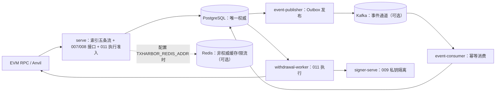
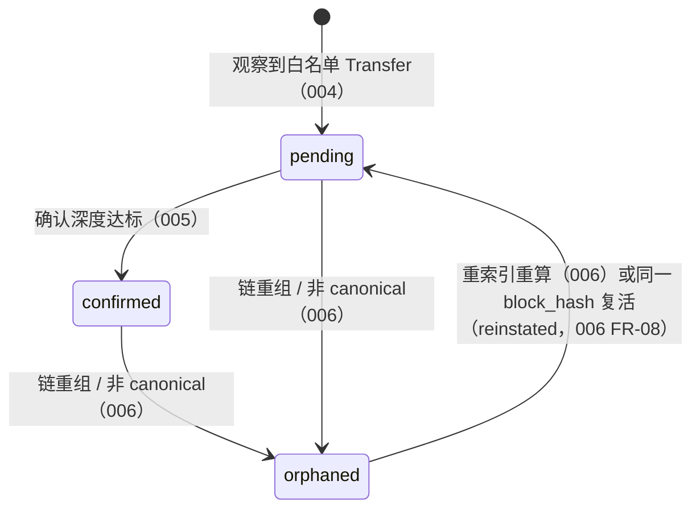
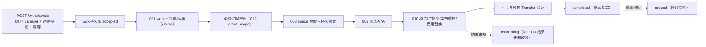

# TxHarbor 架构与设计说明

> **事实边界**：本文件只描述已合入 main 的实现。项目**未部署**、T000-P 保持 OPEN、不宣称生产 SLO；
> 性能相关内容只做「测量与定位」，不宣称性能提升。
> **权威来源**：`specs/001-project-foundation/` … `specs/015-backup-recovery-safe-resumption/`
> （各阶段 spec / plan / data-model / contracts / ADR）、`docs/ops/recovery-runbook.md`、迁移与代码注释。
> 本文件是导览与图示；与规格或代码冲突时，以规格与代码为准，不在此复制第二套规格。
> 文中 Mermaid 图已通过 `mermaid.parse`（jsdom 环境，v11）**语法解析验证（README 与本文件合计 4/4；本文件 3/3）**；
> 未做像素级渲染验证。

## 1. 组件与数据流

| 进程 | 子命令 | 职责（代码入口） |
| --- | --- | --- |
| 业务进程 | `serve` | 单 HTTP 监听器；索引五条流（header/log/deposit/confirm/recovery）在同一租约循环与心跳下运行；挂载 007/008 接口、011 执行准入与健康/指标（`internal/app/serve.go`） |
| 签名进程 | `signer-serve` | 009 独立监听器（默认 `127.0.0.1:8091`）；`development` 模式加载本地密钥文件，`production` 模式无 provider 即拒绝启动（`internal/app/signerserve.go`、`internal/signer`） |
| 执行进程 | `withdrawal-worker` | 011 worker：领取/续租、调用 010 生命周期与 009 签名、状态投影与恢复追踪（`internal/app/withdrawalworker.go`、`internal/jointwire`） |
| 事件发布 | `event-publisher` | 事务性 Outbox 发布器：租约领取、至少一次投递、blocked 可见可审计（`internal/app/eventpublisher.go`、`internal/events`） |
| 事件消费 | `event-consumer` | 幂等消费者：inbox 去重、版本守卫、持久进度、隔离与人工重放（`internal/app/eventconsumer.go`、`internal/events`） |
| 管理 CLI | `migrate` / `confirm-auth` / `apikey-auth` / `withdrawal-authz` / `nonce-admin` / `signer-auth` / `withdrawal-exec` / `events-admin` / `reconcile-admin` / `recovery-admin` | 迁移与受控运维（授权供给/撤销、重放、恢复核验与放行等） |

权威规则：

- **PostgreSQL 是唯一权威数据源**：所有持久化业务状态只落 PG；Redis/Kafka 故障不改变资金事实。
- **Outbox → Kafka → 消费者**：事件经 `event-publisher` 投递到 Kafka，再由 `event-consumer` 处理；
  **Redis 不在该投递链上**（Kafka 才是事件通道）。
- **Redis 默认未启用**：仅配置 `TXHARBOR_REDIS_ADDR` 时 `serve` 才装配缓存与限流；
  `TXHARBOR_EVENTS_ENABLED` 默认 `false`（发布器/消费者不启动）。不声称查询缓存已启用。
- **限流失败策略（PD-1）**：令牌耗尽 → `429`（`temporarily_unavailable`，带 `Retry-After`，提示同 key 重试）；
  限流不可用（Redis 故障）→ **仅**新提现创建 `POST /withdrawals` 返回 `503` 可重试拒绝，
  查询回退 PG 继续，执行等其它路径按原门禁继续；类未配置 → fail-closed 报错，绝不静默放行
  （`internal/ratelimit/policy.go`）。
- **启动门禁**：数据库版本不兼容时拒绝启动且从不自动迁移；`chain_id` 不匹配、
  冻结配置身份与持久行不一致等同样拒绝启动。

## 2. Deposit 生命周期

关键不变量：

- **连续高度同步**：区块头按高度连续推进并校验 `chain_id`；缺口不跳过（002）。
- **冻结配置身份**：日志索引启动时比对（起始高度 + 白名单哈希）；持久行与配置不一致即拒绝读写（003）。
- **确认深度**：`max(0, canonical_tip − block_number + 1) ≥ N`；阈值版本化，切换触发重判（005）。
- **重组恢复**：在配置最大深度内找共同祖先，旧分叉失效、受影响充值转 `orphaned`，随后重索引与重算；
  恢复状态持久化、可崩溃续跑、重复执行幂等（006）。
- **修订事实**：重组产生 `deposit.observation.reinstated`（同一旧 `block_hash` 重新 canonical 的就地复活）
  与 `deposit.revision.applied`（修订生效）事件，由消费者幂等吸收（013；`internal/indexer/outbox_events.go`）。

## 3. Withdrawal 生命周期

- **接收 ≠ 执行**：`POST /withdrawals` 只做认证、授权校验与幂等持久化（`status='accepted'`），
  不分配 nonce、不签名、不广播；幂等由 `UNIQUE(caller_id, idempotency_key)` 保证（007）。
- **执行状态机**（011 迁移 `000012`）：`admitted → claimed → executing → completed`
  （旁路 `failed` / `reconciling` / `revised`）；执行步骤 `issued/converged/refused/unknown`；
  请求状态投影带 `freshness`（`confirmed` / `possibly_stale`）。
- **nonce**：预留 + 持久绑定 + 结果未知/缺口对账；只读绑定查询端点（008）。
- **签名隔离**：私钥只在 Signer 进程；业务进程只持有签名结果（009）。
- **结果未知与对账**：未知结果由 010/011 按链上事实收敛（`reconciling`），不重付、不重广播；
  014 提供跨源差异扫描与处置兜底。
- **completed 之后仍保持追踪**：重组/修订会更新投影（`revised`），不把「已完成」当作终态免检。

## 4. PostgreSQL 权威状态设计

- **唯一权威**：所有持久写入落在 PG；Redis（缓存/限流）与 Kafka（事件通道）都不是权威。
- **幂等靠数据库约束**：金融操作以 UNIQUE 约束去重，不依赖应用层检查。
- **显式状态与版本守卫**：状态迁移显式；消费者以 `consumer_versions` 做版本守卫（013）；
  确认阈值与配置身份版本化（005/003）。
- **迁移与兼容门禁**：迁移 `000001`–`000018`（goose，embed 进二进制）；
  `serve` 发现未应用或未知迁移版本即拒绝启动，**从不自动迁移**。
- **表家族概览**（按域，非完整清单）：
  - 链与充值：区块头/日志索引、`deposit_observations`、确认与重组（`000002`–`000006`）；
  - 提现与执行：`withdrawal_requests`、授权 scope、010 的 `tx_attempts` 系列表、`execution_*`（`000007`–`000014`）；
  - 事件：`outbox_events`、`consumer_progress`、`consumer_inbox`、`consumer_versions`、
    `consumer_quarantine`、`event_ops_audit`、`event_system_state`（`000015`）；
  - 对账：`recon_task`、`recon_checkpoint`、`recon_gap`、`discrepancy`、`disposition`、
    `reverify`、`recon_audit`、`recon_scan_attempt`、`recon_permission`（`000016`）；
  - 事件义务与复核代次：`event_obligation`（`000017`）、复核代次（`000018`）。

## 5. Signer 隔离边界

- **进程与监听器隔离**：`signer-serve` 是独立进程与独立监听器（默认 `127.0.0.1:8091`）；
  业务进程经 HTTP 客户端调用，只持有签名结果。
- **密钥只在 Signer**：`development` 模式从本地密钥文件加载；`production` 模式无 KMS/HSM provider
  即拒绝启动（v1 限制，见 `internal/signer/provider.go`）。
- **策略上限必填**：链 ID、sender、资产、收款方白名单与金额/gas/费用上限（9 个键）缺失即拒绝启动
  （`config.SignerPolicyConfig`）。
- **凭据**：`signer-auth` 签发/轮换/吊销；凭据不进入日志/错误/指标（`internal/logx.Redact` 脱敏）。
- **无 digest 签名面**：`KeyProvider` 边界不暴露任意摘要签名。
- **已知边界**：Serve/Signer/Worker 与管理 CLI 共用同一 `TXHARBOR_PG_DSN`，**无数据库角色隔离**；
  授权撤销是受控 CLI（`withdrawal-authz revoke`）而非 HTTP 写入口，其「隔离」指可信管理入口与业务
  HTTP 路径分离，不代表 DSN 泄漏影响被限制。

## 6. Transactional Outbox / Inbox 语义

- **同事务 Append**：业务状态与事件在同一 PostgreSQL 事务内写入；事件身份由 UUIDv5 派生，
  payload 规范化（catalog v1 信封）。
- **至少一次发布**：发布器以 `SKIP LOCKED` 领取 + 租约（lease）+ `acks=all` 投递；
  `blocked` 状态可见、可审计（`internal/events/publisher.go`）。
- **消费幂等**：`consumer_inbox` 去重、`consumer_versions` 版本守卫、持久进度、有界重试；
  耗尽后进入持久隔离（`consumer_quarantine`）并可人工重放（`events-admin replay`），
  重放不产生新提现意图/nonce/签名/广播。
- **提交顺序**：消费效果先在 PG 事务中提交，随后提交 Kafka offset（效果与进度不双写失配）。
- **语义边界**：**至少一次 + 消费幂等**；**不宣称跨系统恰好一次**。
- **容量保护**：「停新保在途」——可控新资金写入按可重试错误拒绝，链上事实不拒绝；
  无法持久化时按可靠进度暂停补扫，绝不静默丢弃。
- **修订事件**：重组产生 `deposit.observation.reinstated` / `deposit.revision.applied`、
  `withdrawal.execution.revised` 等，由消费者幂等吸收。

## 7. 故障恢复与对账

- **崩溃恢复**：单租约循环 + 心跳覆盖五条流；崩溃点与重启场景有集成测试（硬杀子进程）；
  持久化暂停后按可靠进度续跑。
- **014 对账**：链事实、PG 业务状态、事件投递/消费结果三路比对；有作用域、带检查点、可续跑；
  差异有稳定身份，扫描预算有界，授权默认拒绝（`internal/reconciliation`）。
- **015 备份与安全续跑**：备份 manifest → 隔离目标真实 `pg_restore` 验证 → 恢复实例核验（V1–V9 只读编排）
  → **按能力分级放行**（7 项能力 + 依赖矩阵；按能力/副作用范围要求单人或双人非执行者批准，
  缺口阻塞、旧实例隔离证据）；
  放行前 `POST /withdrawals` 必须 503，`withdrawal-worker`/发布器/消费者拒绝执行
  （`internal/recovery`、`docs/ops/recovery-runbook.md`）。
- **恢复门禁覆盖**：仅在配置 `TXHARBOR_RECOVERY_CONTROL_DSN` 且存在开放恢复实例时生效
  （未配置恢复模式时保持正常模式，健康/指标不受该门禁影响）；业务查询、索引循环
  （`chain_scan` / `deposit_confirmation`）、执行准入、`withdrawal-worker`、发布与消费效果
  受对应能力门禁约束——未放行的新提款创建返回 503，未放行的能力拒绝执行。
- **演练**：五态故障矩阵（Fault 层，`internal/faultdrill`）；灾备演练 S1–S12 + F1–F7（drill 层，
  独立通道，逐场景 PASS 判定）。

## 8. 关键设计决策与取舍

| 决策 | 选择 | 取舍 / 理由 | 出处 |
| --- | --- | --- | --- |
| 事实来源 | PostgreSQL 单一权威；Redis/Kafka 非权威 | 缓存/队列故障不改变资金事实，恢复只需回到 PG | `specs/013-reliable-event-infrastructure/adr.md` |
| 幂等 | 数据库 UNIQUE 约束（非应用层检查） | 并发下不依赖进程内状态；重复请求可安全重放 | 007/008 规格与迁移 |
| 投递语义 | 至少一次 + 消费幂等 | 跨系统恰好一次需分布式协调、代价与故障面更大；不宣称恰好一次 | 013 ADR |
| 状态设计 | 全显式状态机 + 版本守卫 | 可审计、可对账；代价是迁移与守卫代码量 | 005/011/013 |
| 资金动作位置 | 不可逆动作移出 HTTP 处理器 | 请求路径只做接收/准入，执行由 worker 承担 | 007/011 |
| 启动门禁 | fail-closed（配置/版本/chain_id/冻结身份） | 宁可拒绝启动也不进入未定义状态 | `internal/config`、`serve` |
| 缓存/限流 | 默认关闭，按需启用；PD-1 限流失败策略 | 默认 PG-only 基线可运行；仅新提现创建 fail-closed | `internal/ratelimit/policy.go` |
| 密钥管理 | v1 仅 development 密钥 provider | 无 KMS/HSM；`production` 模式拒绝启动 | `internal/signer/provider.go` |
| 传输安全 | 应用内无 TLS（明文监听） | 生产需前置 TLS 终止；未内置 | `internal/app/serve.go` |
| 恢复放行 | 按能力分级 + 非执行者批准（single/dual 按能力与副作用）+ 缺口阻塞 | 不用「数据库可连接」代替资金门禁 | 015 规格与 ADR |

## 9. 图与代码一致性（可复核）

| 图 / 结论 | 复核入口 |
| --- | --- |
| 组件与数据流、进程职责 | `cmd/txharbor/main.go`、`internal/app/serve.go`、`internal/jointwire/assembly.go` |
| Deposit 状态与事件 | `migrations/000004_deposit_detection.sql`、`migrations/000005_confirmation_tracking.sql`、`migrations/000006_reorg_recovery.sql`；`internal/indexer/` |
| Withdrawal 状态机 | `migrations/000007_withdrawal_creation.sql`、`migrations/000011_tx_lifecycle.sql`、`migrations/000012_withdrawal_execution.sql`；`internal/execution/`、`internal/txlifecycle/` |
| Outbox/Inbox 表与语义 | `migrations/000015_event_infrastructure.sql`；`internal/events/` |
| 对账 | `migrations/000016_reconciliation_handling.sql`；`internal/reconciliation/doc.go` |
| 恢复与门禁 | `internal/recovery/doc.go`；`specs/015-backup-recovery-safe-resumption/quickstart.md`；`docs/ops/recovery-runbook.md` |
| 限流策略 | `internal/ratelimit/policy.go`（429/503 分列与类语义） |

**验证状态**：本文件的 Mermaid 图已通过 `mermaid.parse`（jsdom 环境，mermaid v11）语法解析
（README 与本文件合计 4/4；本文件 3/3）；图示状态词汇已与迁移 `CHECK` 约束和包文档核对。**未做**像素级渲染验证，
也**未**逐一执行运行时行为验证；演练/恢复的行为结论见 `docs/verification-matrix.md` 的状态与证据列。
