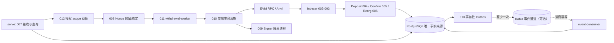

# TxHarbor 展示材料（简历作品 · 集中版）

> **事实边界（先读）**：本材料只描述已提交的实现与已归档的证据。
> 不声称性能提升、不声称查询缓存已启用、不维护余额账本、未生产上线、无生产 SLO；
> 未部署（T000-P 保持 OPEN）。性能相关内容一律写「测量、定位」。
> 所列命令均为仓库**现有**入口（`Makefile` / README §测试入口）；本轮文档整理**未执行**这些
> 命令，故不宣称已验证；需要时按现有定义在本地运行。
> CI 诚实性：main 推送 CI 首次失败、同 SHA 单次重试成功，**原因尚未确认**，不声称根因已修复。

## 1. 30 秒项目介绍

**解决什么问题**：EVM 充值/提现基础设施的「正确性」问题——链重组、进程崩溃、重复投递、
交易结果未知、私钥隔离，任何一个处理错误都会造成资金差错；项目把这些失败场景当作一等公民
来设计和验证。

**技术栈**：Go 1.26 单二进制多子命令（serve / signer-serve / withdrawal-worker /
event-publisher / event-consumer + 管理 CLI）；PostgreSQL 18.6 唯一事实来源；Anvil（foundry
v1.8.1）本地链；可选 events profile（Redis/Kafka，非权威）；Prometheus `/metrics`、
`/livez`、`/readyz`；testcontainers 集成测试；无 KMS/HSM、无 TLS、无 Dockerfile（进程在宿主运行）。

**核心能力**：充值链 002–006（连续高度同步 → 白名单 ERC-20 日志索引 → 充值观察 → 确认深度 →
重组恢复）；提现链 007–012（受认证接收与逐笔授权 → nonce 预留/绑定 → 隔离签名 → 交易生命周期
→ 执行 worker 与恢复追踪）；013 可靠事件（事务性 Outbox、至少一次投递 + 消费幂等、五态故障
矩阵、容量保护与恢复追赶）；015 备份恢复安全续跑；证据工程（测量批次、原始归档 + 清单/指纹、
独立复算与 review 闭合）。

## 2. 简明架构与 5 分钟演示讲稿

### 2.1 架构（角色与数据流）



- 单一 Go 二进制、多进程角色；PostgreSQL 是唯一事实来源，不存在 Redis/Kafka 财务状态。
- 不可逆资金动作不在 HTTP 处理器内执行；私钥只存在于 Signer 进程。
- Redis 仅非权威用途（缓存 / fail-closed 限流，013）；与 Kafka 一样仅在 013 events profile 下按需启用，
  本材料不声称其已启用。默认 PG-only 基线（PG + Anvil）不启动发布器/消费者。

### 2.2 演示顺序（启动入口 → 充值 → 提现 → 故障恢复）

以下命令均引用仓库现有定义（README §本地配置与快速启动、§测试入口、`Makefile`）；
**不承诺环境初始化耗时**（首次拉取镜像/构建视网络与本机而定）。

1. **启动入口（约 1 分钟）**
   ```bash
   docker compose up -d                  # PostgreSQL(5432) + Anvil(8545)，仅绑定 127.0.0.1
   go run ./cmd/txharbor migrate up      # 应用迁移（serve 不会自动迁移）
   go run ./cmd/txharbor serve           # 终端 A：业务进程（读路径 + 执行路由）
   # 终端 B：TXHARBOR_SIGNER_MODE=development TXHARBOR_SIGNER_KEY_FILE=... go run ./cmd/txharbor signer-serve
   # 终端 C：TXHARBOR_TX_SIGNER_URL=... go run ./cmd/txharbor withdrawal-worker
   # 013（可选）：docker compose --profile events up -d；event-publisher / event-consumer
   ```
2. **充值链（约 1 分钟）**：`make test-integration`（002–006 的 PostgreSQL 层，需 Docker）——
   演示连续高度同步、白名单日志索引、确认深度切换与重组恢复；对应源码见
   `internal/indexer`（`confirm.go` 等：索引/确认/重组）、规格见
   `specs/002-chain-indexer/` … `specs/006-reorg-recovery/`（002–006 各阶段目录）。
3. **提现链（约 1.5 分钟）**：`make test-e2e`（007–011 核心充提全链，全栈 + Anvil）——
   演示接收幂等（caller_id + idempotency_key）、逐笔授权、nonce 预留与绑定、隔离签名、
   广播/同字节重播/费用替换、回执与预期 Transfer 验证。
4. **故障恢复（约 1.5 分钟）**：`make test-fault`（五态故障矩阵）；随后
   `TXHARBOR_DRILL_EVIDENCE_DIR=<dir> make test-drill`（S1–S12 + F1–F7 全量演练；
   JSON 检查器要求逐场景 PASS，缺失/跳过即失败，**NOT RUN 不允许冒充通过**）。
   崩溃边界在 `internal/txlifecycle/crash_integration_test.go`（8 个硬杀子进程场景，
   `integration` 标签层内）；恢复手册见 `docs/ops/recovery-runbook.md`。

## 3. 三条简历要点（可直接复制）

1. **正确性设计**：以 PostgreSQL UNIQUE 约束而非应用层检查保证幂等；状态迁移全部显式化、
   不可逆资金动作移出 HTTP 处理器；充值链按 canonical 链处理重组（共同祖先 → 旧分叉失效 →
   重索引重算），提现链以「nonce 预留/持久绑定 → 隔离签名 → 结果未知对账」闭环。
2. **故障恢复**：崩溃点与重启场景集成测试（硬杀子进程）、租约/心跳、持久化暂停与恢复续跑；
   `make test-drill` 全量演练 S1–S12/F1–F7 由 JSON 检查器逐项校验，缺失或跳过即失败
   （NOT RUN 纪律），故障矩阵与演练有归档证据。
3. **证据验证**：自建测量接缝（`perf` 构建标签，普通构建 no-op）+ 串行批次 + 原始归档
   （`SHA256SUMS`、采集时源码指纹）+ 独立复算与 review 闭合（审计工具回归 17/17、
   runner 批次根保护夹具 8/8）；性能只做**测量与定位**（如尾窗覆盖 99.93%、
   `process` 占 tail 99.09–99.28%），不写未实现的性能提升。

## 4. 五个核心面试问答

**Q1｜为什么 PostgreSQL 是唯一事实来源，Redis/Kafka 不承载财务状态？**
幂等与并发正确性靠数据库约束（UNIQUE）与事务保证，缓存/队列只做非权威加速与投递；
Redis 限流为 fail-closed（PD-1），Kafka 仅承载事件（至少一次）。这样任何缓存/队列故障
都不会改变资金事实，恢复只需回到 PG。

**Q2｜链重组如何保证充值正确？**
以 canonical 链为准：检测分叉后在配置最大深度内找共同祖先，旧分叉失效、受影响充值转
Orphaned，随后重新索引/识别/计算确认；恢复状态持久化、重复执行幂等、可崩溃续跑
（006；阈值版本化与重判见 005）。已知边界：仅配置深度内的重组有保证，生产阈值待校准。

**Q3｜提现如何做到私钥隔离与「结果未知」处置？**
009 独立进程持钥，业务进程只拿签名结果；`production` 模式无 KMS/HSM provider 时
fail-closed 拒绝启动（v1 限制：无 KMS/HSM、无 TLS，生产需自行前置）。008 预留并持久绑定
nonce；010 处理同字节重播、费用替换、回执与预期 Transfer 验证；对账处置未知结果。

**Q4｜事件基础设施为何是「至少一次 + 消费幂等」而不是恰好一次？**
事务性 Outbox 把业务状态与事件写入同一事务，跨系统「恰好一次」需要分布式协调、代价与
故障面更大；选择至少一次 + 消费端幂等（inbox 去重）把复杂度放在可验证的一侧，
**不宣称跨系统恰好一次**；重组会产生修订事件，由消费者幂等吸收。

**Q5｜性能工作如何「测量与定位」而不夸大？**
`perf` 标签接缝（普通构建零逻辑）+ ON/OFF 同接缝配对（只衡量细分采集增量）+ 串行批次与
原始归档；用尾窗裁剪与嵌套关系把 tail 分解到 `process`→`tx_total`→7 条语句链
（覆盖 99.93%、`process` 99.09–99.28%、语句链占 `tx_total` 98.8%）。局限：单机、n≤4、
顺序/漂移不可分解，pristine 两书挡不能分解测点开销；结论不构成 SLO。
证据诚实性包含 CI：main 推送首次失败（PostgreSQL 层
`TestRestoreInterruptionNotRestoredAndRerunIdempotent`）、同 SHA 单次重试成功，
**原因尚未确认**。

## 5. 证据与入口索引（可定位）

- **源码**：`internal/events/consumer.go`（观测接缝 + 消费循环）、`scripts/consumerseg/run_batch.sh`、
  `scripts/consumerseg/analyze/`、`internal/txlifecycle/crash_integration_test.go`、
  `internal/recovery/backup_integration_test.go`、`internal/signer/`、`internal/nonce/`。
- **演练/恢复**：`docs/ops/recovery-runbook.md`、`Makefile`（`test-drill` 目标与 NOT RUN 纪律）、
  `scripts/drillcoverage/check.go`、`docs/evidence/015/`、`docs/evidence/015-fix-drill-runner-modcache/`。
- **性能诊断**：`docs/evidence/013-supplement/consumer-seg/README.md`（口径与结论）、
  `docs/evidence/013-supplement/consumer-seg/CORRECTIONS.md`（review #1–#8 与 P2 闭合）、
  `docs/evidence/013-supplement/consumer-seg/analysis/summary.md`（派生统计）、
  `docs/evidence/013-supplement/consumer-seg/checks/`（本轮核验日志与可重跑审计脚本）、
  `docs/evidence/019-normal-query-seg/`（对照批次）。
- **013 证据索引**：`docs/evidence/013/quickstart_evidence_index.md`（实现经 PR #25 进入 main；
  未部署，容量/限流/追赶阈值待测/待裁决）。
- **CI**：PR #44 运行 [37745833563](https://github.com/xtianxx/TxHarbor/actions/runs/37745833563)（success）；
  main 推送运行 [37748375307](https://github.com/xtianxx/TxHarbor/actions/runs/37748375307)
  （attempt 1 failure → attempt 2 success；原始日志与元数据留存于本地 git-ignored 审计目录
  `.evidence/ci-runs/verify/013-consumer-seg-pr44/`）。
